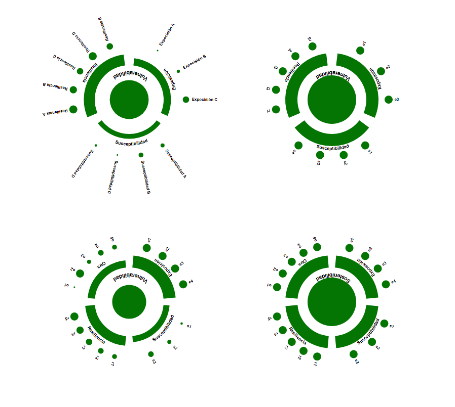
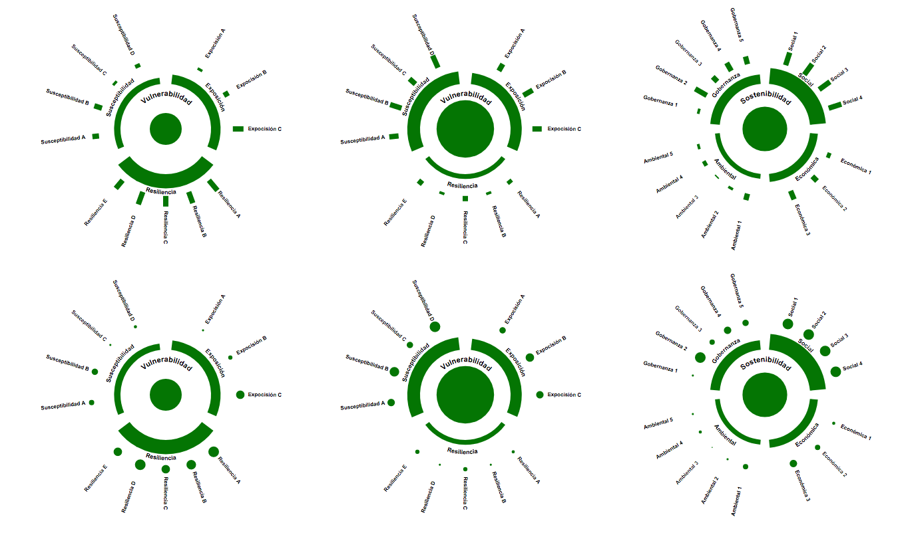
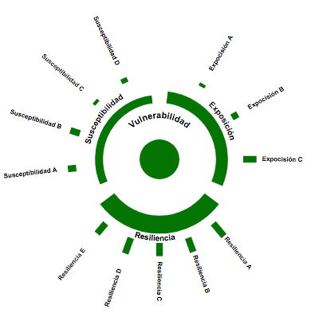
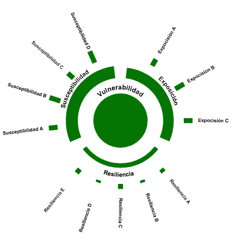
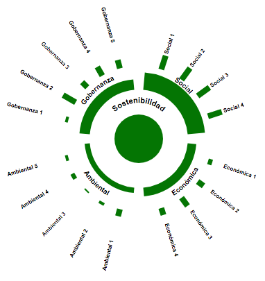
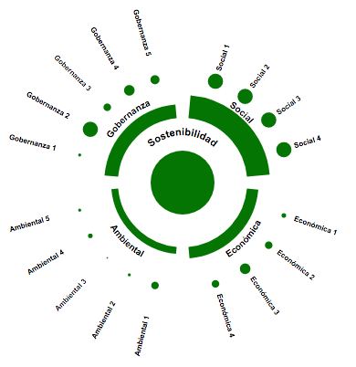
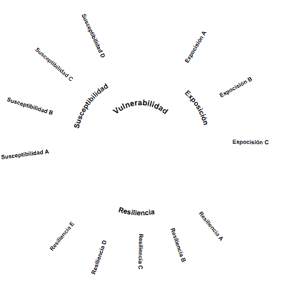

# glyph_generator

o con labels:

o con barras

uso:

gw.makeBarGlyph("glyph1.svg", 400, data1, True, True)

gw.makeBarGlyph("glyph2.svg", 400, data2, True, True)

gw.makeBarGlyph("glyph3.svg", 400, data3, True, True)

gw.makeGlyph("glyph4.svg", 400, data1, True, True)

gw.makeGlyph("glyph5.svg", 400, data2, True, True)

gw.makeGlyph("glyph6.svg", 400, data3, True, True)

gw.makeLabels("labels.svg", 400, data1)

gw.makeGlyph("glyph7.svg", 400, data1, False, True)

