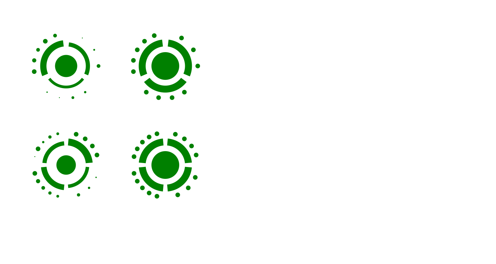
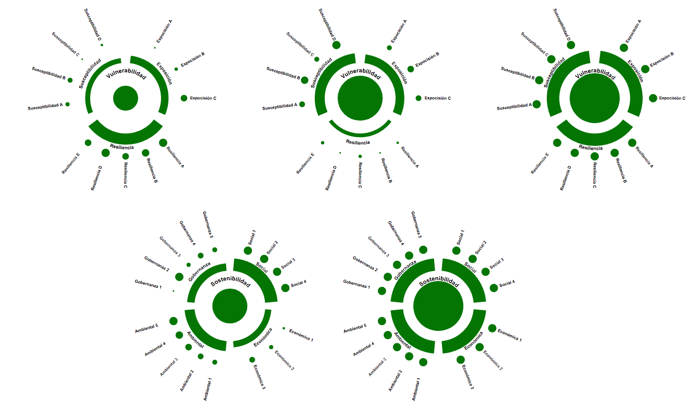
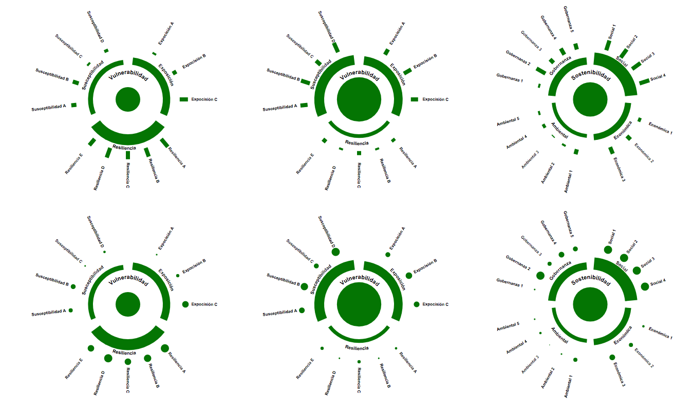
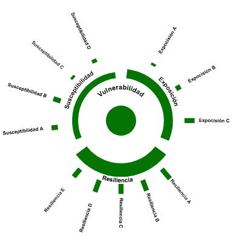
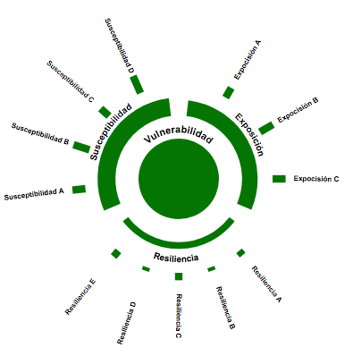
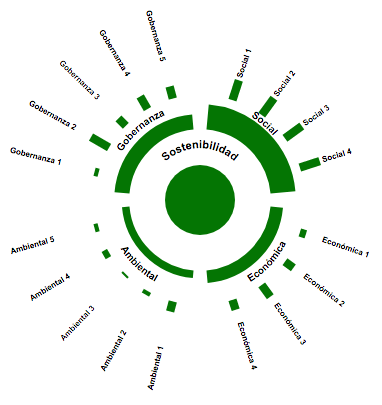
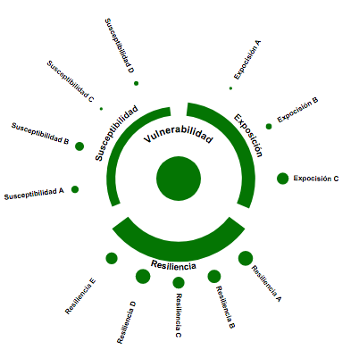
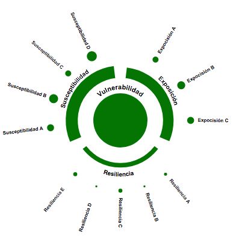
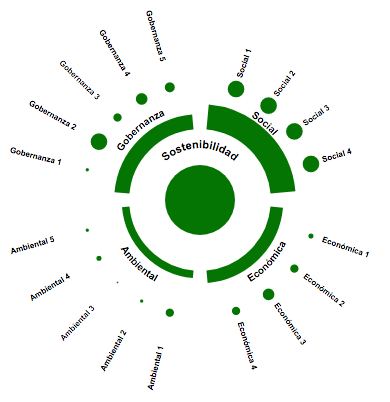
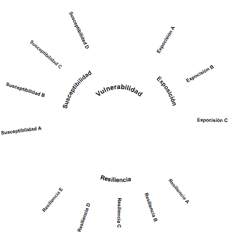

# Hier-'o-glyph!

Visualize hierarchical indexes with a nice glyph.

### With labels

### Bars in the outmost track

## Usage

    gw.makeBarGlyph("glyph1.svg", 400, data1, True, True)

    gw.makeBarGlyph("glyph2.svg", 400, data2, True, True)

    gw.makeBarGlyph("glyph3.svg", 400, data3, True, True)

    gw.makeGlyph("glyph4.svg", 400, data1, True, True)

    gw.makeGlyph("glyph5.svg", 400, data2, True, True)

    gw.makeGlyph("glyph6.svg", 400, data3, True, True)

    gw.makeLabels("labels.svg", 400, data1)

    gw.makeGlyph("glyph7.svg", 400, data1, False, True)

