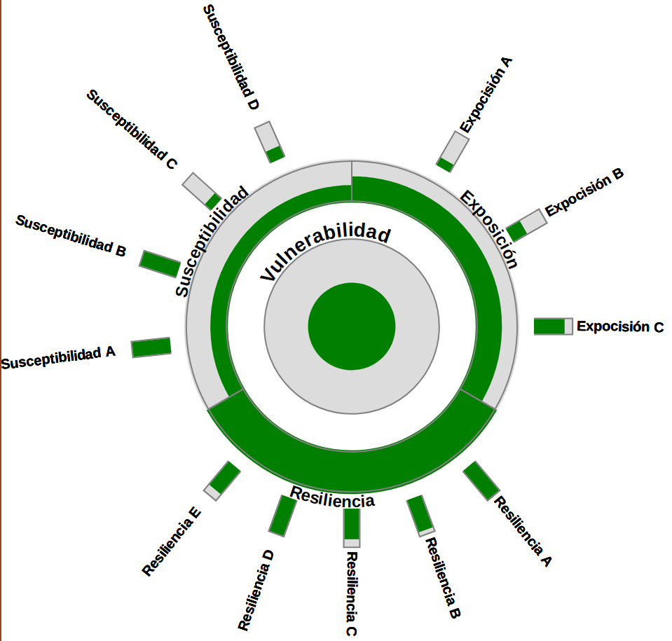

# Hier-o-glyph!

Visualize hierarchical indexes with a nice glyph.

# Usage

	import hieroglyph
	data = {"total": {"name": "Vulnerabilidad",
					   "value": 0.5},
			 "categories": [
				 {"name": "Exposición",
				  "value": 0.6,
				  "subcategories": [
					  {"name": "Expocisión A", "value": 0.2},
					  {"name": "Expocisión B", "value": 0.4},
					  {"name": "Expocisión C", "value": 0.8}, ]},
				 {"name": "Resiliencia",
				  "value": 1.0,
				  "subcategories": [
					  {"name": "Resiliencia A", "value": 1.0},
					  {"name": "Resiliencia B", "value": 0.9},
					  {"name": "Resiliencia C", "value": 0.8},
					  {"name": "Resiliencia D", "value": 1.0},
					  {"name": "Resiliencia E", "value": 0.8}, ]},
				 {"name": "Susceptibilidad",
				  "value": 0.4,
				  "subcategories": [
					  {"name": "Susceptibilidad A", "value": 1},
					  {"name": "Susceptibilidad B", "value": 1},
					  {"name": "Susceptibilidad C", "value": 0.2},
					  {"name": "Susceptibilidad D", "value": 0.3}, ]},
			 ]}

	g = hieroglyph.Glyph(svg_width=500,
						 data=data,
						 labels=True,
						 toEnsableLabelsLater=False,
						 path="glyph.svg")

	g.render(mode='bars')

Will create:

